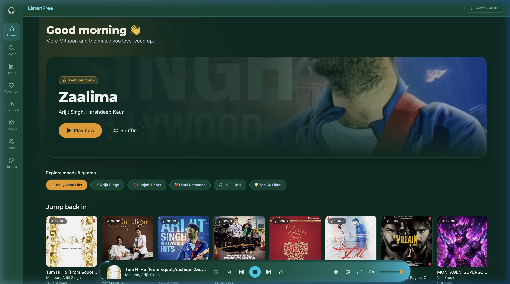
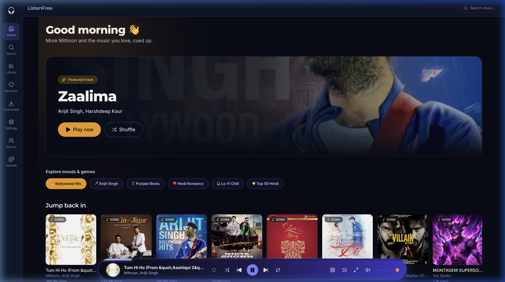
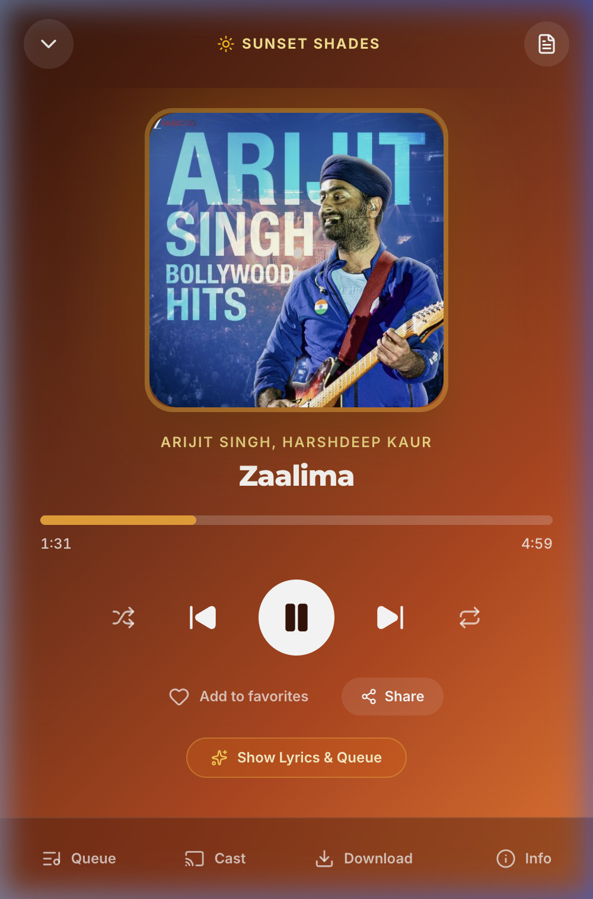
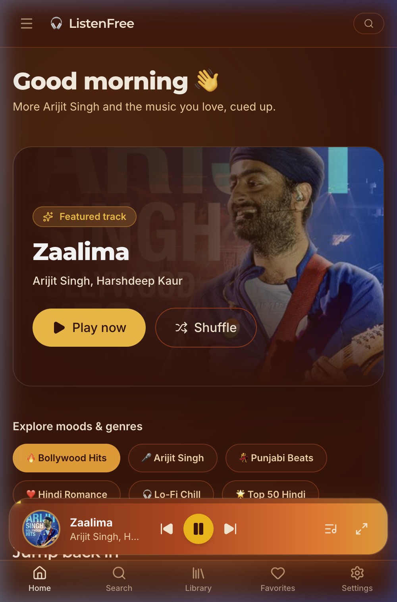

<div align="center">

# 🎧 PurePlay
### *Next-Generation, Ad-Free Music & Audio Streaming Experience*

[](https://reactjs.org/)
[](https://vitejs.dev/)
[](https://www.typescriptlang.org/)
[](https://tailwindcss.com/)
[](LICENSE)

<p align="center">
  <a href="#-key-features">Key Features</a> •
  <a href="#-player-appearance-themes">Player Themes</a> •
  <a href="#-screenshots">Screenshots</a> •
  <a href="#-tech-stack">Tech Stack</a> •
  <a href="#-getting-started">Getting Started</a>
</p>

---

</div>

## 🌟 Overview

**PurePlay** is a sleek, ultra-fast, ad-free web music application built with **React 18**, **TypeScript**, **Vite**, and **Tailwind CSS**. It delivers high-fidelity audio streaming, real-time synchronized lyrics, rich playlist curation, offline caching, interactive music games, and **9 customizable, system-wide player themes**.

---

## ✨ Key Features

- ⚡ **Lightning Fast Streaming**: High-quality audio playback with instant searching across millions of tracks.
- 🎨 **9 System-Wide Player Themes**: Personalize the player and entire web application with curated design themes (including *Arc Studio*, *Cosmic Aurora*, *Cherry Blossom*, and *Neumorphic*).
- 🎤 **Live Synchronized Lyrics**: Automatic line-by-line scrolling lyrics synchronized with track position.
- 📱 **Responsive Floating Pill Player**: A modern mobile floating island player sitting seamlessly above navigation bars across all screen sizes.
- 📥 **Offline Download & Caching**: Save favorite tracks locally for offline listening using IndexedDB.
- 🎮 **Heardle Music Trivia**: Test your music knowledge with an interactive daily track guessing game.
- 👥 **Real-Time Rooms**: Create co-listening rooms to listen synchronously with friends.
- 🎛️ **Full Audio Equalizer**: Custom bass boost, audio spatializer, and frequency band adjustments.
- ⌨️ **Keyboard Shortcuts**: Full media control using standard hotkeys (`Space`, `k`, `j`, `l`, `m`, `f`, `s`).

---

## 🎨 Player Appearance Themes

Choose from **9 crafted visual themes** in Settings. Switching player appearance automatically synchronizes colors across the **entire application UI** (Home, Search, Library, Sidebars, and Backgrounds):

| Theme Name | Style Description | Palette Accent |
| :--- | :--- | :--- |
| 🌀 **Arc Studio** | Curved arch artwork frame with emerald teal & cyan glow | `#022c22` → `#06b6d4` |
| 🌌 **Cosmic Aurora** | Midnight indigo backdrop with circular orb glowing artwork | `#090d16` → `#6366f1` |
| 🌸 **Cherry Blossom** | Vibrant deep crimson backdrop with soft pink highlights | `#2e050e` → `#f43f5e` |
| 🌅 **Sunset Shades** | Warm amber, orange, and terracotta burnt sunset gradient | `#3b1207` → `#f97316` |
| 💎 **Glass Pro** | Ultra-clean glassmorphic backdrop filter with sky blue accents | `#0c1a2e` → `#38bdf8` |
| ⚡ **Vibrant** | Rich neon purple & deep indigo gradient | `#3b0764` → `#a855f7` |
| 🪨 **Neumorphic** | Tactile soft-shadow cream & beige tactile elements | `#d6cfc4` → `#b8a990` |
| 🖤 **Minimal** | Ultra-sleek distraction-free dark mode with mono layout | `#111827` → `#3b82f6` |
| 💜 **Classic** | Signature deep purple & violet dark mode | `#1e1432` → `#8b5cf6` |

---

## 📸 Screenshots

<div align="center">

### 🌀 Arc Studio Theme (Home Page & Floating Pill Player)


### 🌌 Cosmic Aurora Theme (Home Page & Floating Pill Player)


### 🌅 Sunset Shades Theme (Full Player View)


### 📱 Mobile View (Floating Pill Player & Bottom Navbar)


</div>

---

## 🛠️ Tech Stack

- **Frontend Core**: [React 18](https://reactjs.org/), [TypeScript](https://www.typescriptlang.org/), [Vite](https://vitejs.dev/)
- **Styling**: [Tailwind CSS](https://tailwindcss.com/), [Lucide React Icons](https://lucide.dev/), [Framer Motion](https://www.framer.com/motion/)
- **State Management**: [Zustand](https://github.com/pmndrs/zustand)
- **Local Database**: [idb (IndexedDB)](https://github.com/jakearchibald/idb) for offline track storage & preferences
- **Audio Engine**: Web Audio API, HTML5 Audio

---

## 🚀 Getting Started

### Prerequisites

- [Node.js](https://nodejs.org/) (v18.0 or higher recommended)
- `npm` or `yarn` or `pnpm`

### Installation

1. **Clone the repository**
   ```bash
   git clone https://github.com/himanshudev28/PurePlay.git
   cd PurePlay
   ```

2. **Install dependencies**
   ```bash
   npm install
   ```

3. **Start the development server**
   ```bash
   npm run dev
   ```
   Open `http://localhost:5173` in your browser.

4. **Build for production**
   ```bash
   npm run build
   ```

---

## ⌨️ Keyboard Shortcuts

| Key | Action |
| :---: | :--- |
| `Space` or `k` | Play / Pause track |
| `j` | Seek backward 10 seconds |
| `l` | Seek forward 10 seconds |
| `m` | Mute / Unmute audio |
| `f` | Toggle Full Player overlay |
| `s` | Toggle Shuffle mode |
| `r` | Cycle Repeat mode (Off / All / One) |

---

## 📄 License

Distributed under the MIT License. See `LICENSE` for more information.

---

<div align="center">

Made with ❤️ by [himanshudev28](https://github.com/himanshudev28)

</div>
